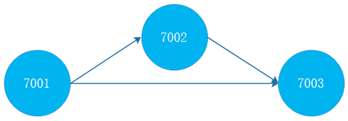
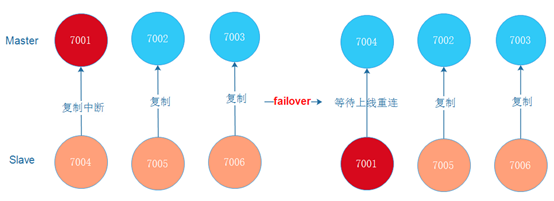
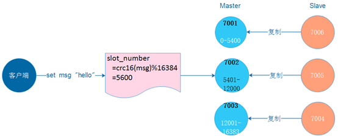
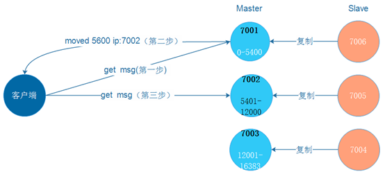

## 集群模式基础
###### 1.哨兵模式的缺陷
- 在哨兵模式中，仍然只有一个Master节点。当并发写请求较大时，哨兵模式并不能缓解写压力。我们知道只有主节点才具有写能力，那如果在一个集群中，能够配置多个主节点，是不是就可以缓解写压力了呢？
  - 这个就是redis-cluster集群模式。

##### 2.Redis-cluster集群概念
  - 由多个Redis服务器组成的分布式网络服务集群；
  - 集群之中有多个Master主节点，每一个主节点都可读可写；
  - 节点之间会互相通信，两两相连；
  - Redis集群无中心节点。

##### 3.集群节点复制 

- 在Redis-Cluster集群中，可以给每一个主节点添加从节点，主节点和从节点直接遵循主从模型的特性。当用户需要处理更多读请求的时候，添加从节点可以扩展系统的读性能。

##### 4. 故障转移
- Redis集群的主节点内置了类似Redis Sentinel的节点故障检测和自动故障转移功能，当集群中的某个主节点下线时，集群中的其他在线主节点会注意到这一点，并对已下线的主节点进行故障转移。

- 集群进行故障转移的方法和Redis Sentinel进行故障转移的方法基本一样，不同的是，在集群里面，故障转移是由集群中其他在线的主节点负责进行的，所以集群不必另外使用Redis Sentinel。

##### 5.集群分片策略
- Redis-cluster分片策略，是用来解决key存储位置的。
- 集群将整个数据库分为16384个槽位slot，所有key-value数据都存储在这些slot中的某一个上。一个slot槽位可以存放多个数据，key的槽位计算公式为：slot_number=crc16(key)%16384，其中crc16为16位的循环冗余校验和函数。
- 集群中的每个主节点都可以处理1个至16383个槽，当16384个槽都有某个节点在负责处理时，集群进入上线状态，并开始处理客户端发送的数据命令请求。

###### 6.集群redirect转向 
- 由于Redis集群无中心节点，请求会随机发给任意主节点
  - 主节点只会处理自己负责槽位的命令请求，其它槽位的命令请求，该主节点会返回客户端一个转向错误
  - 客户端根据错误中包含的地址和端口重新向正确的负责的主节点发起命令请求。

