## Redis哨兵模式
### **什么是哨兵（Sentinel)**
- 搭建实例采用三个哨兵形成集群，三个数据节点（一主两从）方式搭建，如下图所示：
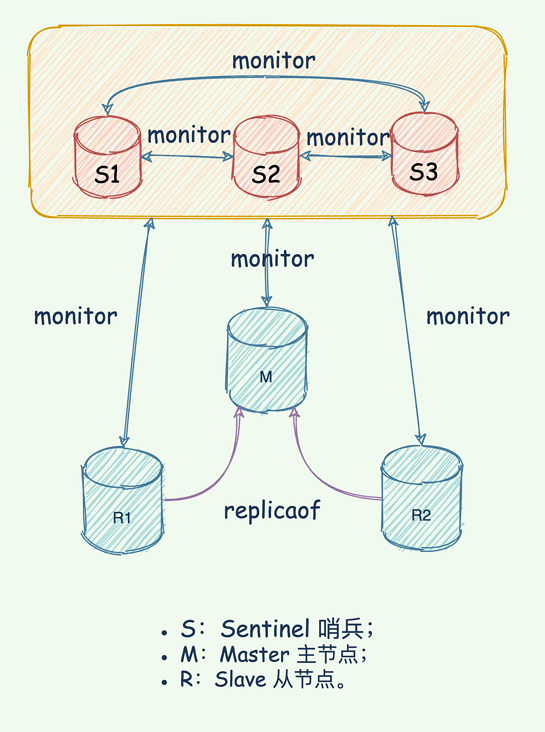
- 大家你听过「武当派」创始人张三疯么？Redis 主从架构就好比一个武当，掌门人就是 Master。掌门人如果挂了，需要从武当七侠里面选举能人担当掌门人。这就需要一个部门能监控掌门人的生死和武当其他弟子的生命状态，并且能够通过投票从武当弟子中选举一个能者担任新掌门，接着再举行新闻发布会向世界宣布新掌门的信息。这个「部门」就是哨兵。
- 哨兵在选举新掌门会遇到以下几个问题：
   - 如何判断掌门真的挂了，有可能假死；
   - 到底选择哪一个武当子弟作为新掌门？
- 通过新闻发布会将新掌门的相关信息通知到所有武当弟子（slave 和 master）和整个武林（客户端）。
- 哨兵部门主要负责的任务是：监控整个武当、选择新掌门，通知整个武当和整个武林。

<br>

#### **哨兵机制的主要任务**
- 哨兵是 Redis 的一种运行模式，它专注于对 Redis 实例（主节点、从节点）运行状态的监控，并能够在主节点发生故障时通过一系列的机制实现选主及主从切换，实现故障转移，确保整个 Redis 系统的可用性。结合 Redis 的 官方文档，可以知道 Redis 哨兵具备的能力有如下几个：
  - 监控：持续监控 master 、slave 是否处于预期工作状态。
  - 自动切换主库：当 Master 运行故障，哨兵启动自动故障恢复流程：从 slave 中选择一台作为新 master。
  - 通知：让 slave 执行 replicaof ，与新的 master 同步；并且通知客户端与新 master 建立连接。
- 哨兵也是一个 Redis 进程，只是不对外提供读写服务，通常哨兵要配置成单数，为啥呢？
- 那到底「哨兵」这个神秘部门是如何实现这三个能力的？下面我们先从全局观看哨兵，简要的了解整个运作流程，接着再针对每一个任务详细分析。首先从监控开始…...

<br>

- **监控**
- Sentinel 只是武当弟子中的特殊部门，在默认情况下，Sentinel 通过飞鸽传书以每秒一次的频率向所有武当弟子、掌门与哨兵（包括 Master、Slave、其他 Sentinel 在内）发送 PING 命令，如果 slave 没有在在规定时间内响应「哨兵」的 PING 命令，「哨兵」就认为这哥们可能嗝屁了，就会将他记录为「下线状态」；
- 假如 master 掌门没有在规定时间响应 「哨兵」的 PING 命令，哨兵就判定掌门下线，开始执行「自动切换 master 掌门」的流程。
- PING 命令的回复有两种情况：
  - 有效回复：返回 +PONG、-LOADING、-MASTERDOWN 任何一种；
  - 无效回复：有效回复之外的回复，或者再指定时间内返回任何回复。
- 哨兵如何判断「掌门」嗝屁呢？掌门诈尸咋办？为了防止掌门「假死」，「哨兵」设计了「主观下线」和「客观下线」两种暗号。
  - 主观下线:
    - 哨兵利用 PING 命令来检测掌门、 slave 的生命状态。如果是无效回复，哨兵就把这个哥们标记为「主观下线」。检测到的是武当小弟，也就是 slave 角色。那么就直接标记「主观下线」。因为 master 掌门还在，slave 的嗝屁对整个武当影响不大。依然可以对外开会，比武论剑、吃香喝辣…...如果检测到是 master 掌门完蛋，这时候哨兵不能这么简单的标记「主观下线」，开启新掌门选举。因为有可能出现误判，掌门并没有嗝屁，一旦启动了掌门切换，后续的选主、通知开发布会，slave 花时间与新 master 同步数据都会消耗大量资源。所以「哨兵」要降低误判的概率，误判一般会发生在集群网络压力较大、网络拥塞，或者是主库本身压力较大的情况下。既然一个人容易误判，那就多个人一起投票判断。哨兵机制也是类似的，采用多实例组成的集群模式进行部署，这就是哨兵集群。引入多个哨兵实例一起来判断，就可以避免单个哨兵因为自身网络状况不好，而误判主库下线的情况。同时，多个哨兵的网络同时不稳定的概率较小，由它们一起做决策，误判率也能降低。
  
  <br>
  
  - 客观下线:
    - 判断 master 是否下线不能只有一个「哨兵」说了算，只有过半的哨兵判断 master 已经「主观下线」，这时候才能将 master 标记为「客观下线」，也就是说这是一个客观事实，掌门真的嗝屁了，华佗再世也治不好了。
    - 只有 master 被判定为「客观下线」，才会进一步触发哨兵开始主从切换流程。
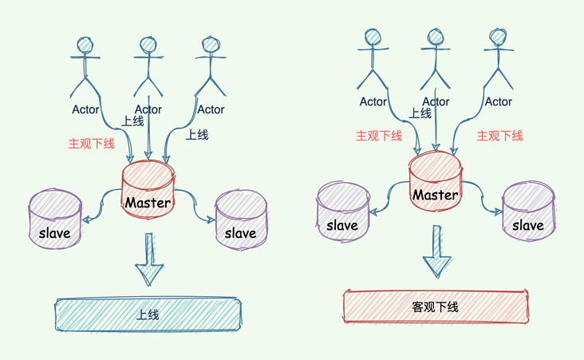

<br>

- **主观下线与客观下线的区别:**
- 简单来说，主观下线是哨兵自己认为节点宕机，而客观下线是不但哨兵自己认为节点宕机，而且该哨兵与其他哨兵沟通后，达到一定数量的哨兵都认为该哥们嗝屁了。
- 这里的「一定数量」是一个法定数量（Quorum），是由哨兵监控配置决定的，解释一下该配置：
`sentinel monitor <master-name> <master-host> <master-port> <quorum>`
- 举例如下：
`sentinel monitor mymaster 127.0.0.1 6379 2`
- 这条配置项用于告知哨兵需要监听的主节点：
  - sentinel monitor：代表监控。
  - mymaster：代表主节点的名称，可以自定义。
  - 192.168.11.128：代表监控的主节点 ip，6379 代表端口。
  - 法定数量，代表只有两个或两个以上的哨兵认为主节点不可用的时候，才会把 master 设置为客观下线状态，然后进行 failover 操作。
- 「客观下线」的标准就是，当有 N 个哨兵实例时，要有 N/2 + 1 个实例判断 master 为「主观下线」，才能最终判定 Master 为「客观下线」，其实就是过半机制。

<br>

- **自动切换主库:**
- 「哨兵」的第二个任务，选择新 master 掌门。需要从武当弟子中按照一定规则选择一个牛逼人物作为新掌门，完成选任掌门后，新 master 带领众弟子一起吃香喝辣。按照一定的「筛选条件」 + 「打分」策略，选出「最强王者」担任掌门，也就是通过一些条件海选过滤一些「无能之辈」，接着将通过海选的靓仔全都打分排名，将最高者选为新 master。如图所示：
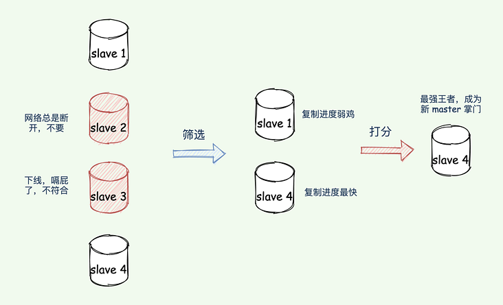
- 网络经常断开的靓仔也不可取，你想，即使变成 master，可是很快网络出了故障，又得重新选择新 master，这不闹着玩么，得排除掉！
- 筛选条件:
  - 从库当前在线状态，下线的直接丢弃；
  - 评估之前的网络连接状态 down-after-milliseconds * 10：如果从库总是和主库断连，而且断连次数超出了一定的阈值（10 次），我们就有理由相信，这个从库的网络状况并不是太好，就可以把这个从库筛掉了。
- 打分:
- 过滤掉不合适的 slave 之后，则进入打分环节。打分会按照三个规则进行三轮打分，规则分别为：
  - slave 优先级，通过 slave-priority 配置项，给不同的从库设置不同优先级（后台有人没办法），优先级高的直接晋级为新 master 掌门。
  - slave_repl_offset与 master_repl_offset进度差距（谁的武功与之前掌门的功夫越接近谁就更牛逼），如果都一样，那就继续下一个规则。其实就是比较 slave 与旧 master 复制进度的差距；
  - slave runID，在优先级和复制进度都相同的情况下，ID 号最小的从库得分最高，会被选为新主库。 （论资排辈，根据 runID 的创建时间来判断，时间早的上位）；

<br>

- **通知**
- 重新选举新 master 掌门这种事情，何等大事，怎能不告知天下。再者其他 slave 弟子也要知道新掌门是谁，一起追随新掌门吃香喝辣大保健。最后一个任务，「哨兵」将新 「master 掌门」的连接信息发送给其他 slave 武当弟子，并且让 slave 执行 replacaof 命令，和新「master 掌门」建立连接，并进行数据复制学习新掌门的所有武功。除此之外，「哨兵」还需要将新掌门的连接信息通知整个武林（客户端），使得让所有想拜访、讨教的人能找到新任掌门，这样诸多事宜才能交给新掌门做决定（将读写请求转移到新 master）。

<br>

- **哨兵的主要任务与实现目标**
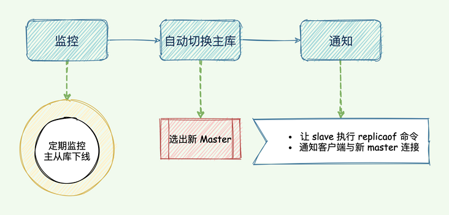

<br>

## 哨兵集群工作原理
- 「哨兵」部门并不是一个人，多个人共同组成一个「哨兵集群」，即使有一些「哨兵」被老王打死了，其他的「哨兵」依然可以共同协作完成监控、新掌门选举以及通知 slave 、master 以及每一个武林人士（客户端）。
- 在配置哨兵集群的时候，哨兵配置中只设置了监控的 master IP 和 port，并没有配置其他哨兵的连接信息。
 `sentinel monitor <master-name> <ip> <redis-port> <quorum>`
- 哨兵之间是如何知道彼此的？如何知道 slave 并监控他们的？由哪一个「哨兵」执行主从切换呢？

##### pub/sub 实现哨兵间通信和发现 slave
- 哨兵之间是如何知道彼此的？
  - 哨兵之间可以相互通信约会搞事情，主要归功于 Redis 的 pub/sub 发布/订阅机制。
  - 哨兵与 master 建立通信，利用 master 提供发布/订阅机制发布自己的信息，比如身高体重、是否单身、IP、端口……
  - master 有一个 __sentinel__:hello 的专用通道，用于哨兵之间发布和订阅消息。这就好比是 __sentinel__:hello 微信群，哨兵利用 master 建立的微信群发布自己的消息，同时关注其他哨兵发布的消息。

- 当多个哨兵实例都在主库上做了发布和订阅操作后，它们之间就能知道彼此的 IP 地址和端口，从而相互发现建立连接。Redis 通过频道的方式对消息进行分别管理，这里的频道其实就是不同的微信群。比如“码哥字节读者技术群”就是专门分享技术的群。朋友们可以关注公众号，后台回复“加群”，一起成长。
- 哨兵之间虽然建立连接了，但是还需要和 slave 建立连接，不然没法监控他们呀，如何知道 slave 并监控他们的？
  - 的确，哨兵之间建立连接形成集群还不够，还需要跟 slave 建立连接，不然没法监控他们，无法对主从库进行心跳判断。
- 除此之外，如果发生了主从切换也得通知 slave 重新跟新 master 建立连接执行数据同步。关键还是利用 master 来实现，哨兵向 master 发送 INFO 命令， master 掌门自然是知道自己门下所有的 salve 小弟的。所以 master 接收到命令后，便将 slave 列表告诉哨兵。
- 哨兵根据 master 响应的 slave 名单信息与每一个 salve 建立连接，并且根据这个连接持续监控哨兵。
- 如图所示，哨兵 2 向 Master 发送 INFO 命令，Master 就把 slave 列表返回给哨兵 2，哨兵 2 便根据 slave 列表连接信息与每一个 slave 建立连接，并基于此连接实现持续监控。剩下的哨兵也同理基于此实现监控。
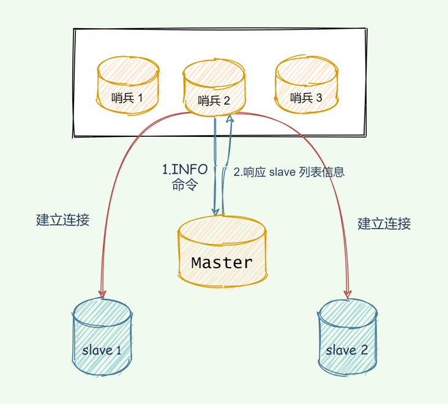
- 选择哨兵执行主从切换
- master 嗝屁了以后，哨兵这么多，那到底让哪一个哨兵来执行新 master 切换呢？
  - 这个跟哨兵判断 master “客观下线”类似，也是通过投票的方式选出来的。任何一个哨兵判断 master “主观下线”后，就会给其他哨兵基友发送 is-master-down-by-addr 命令，好基友则根据自己跟 master 之间的连接状况分别响应 Y 或者 N ，Y 表示赞成票， N 就是反对。如果某个哨兵获得了大多数哨兵的“赞成票”之后，就可以标记 master 为 “客观下线”，赞成票数是通过哨兵配置文件中的 quorum 配置项设定。
  `sentinel monitor <master-name> <ip> <redis-port> <quorum>`
- 比如一共 3 个哨兵组成集群，那么 quorum 就可以配置成 2，当一个哨兵获得了 2 张赞成票，就可以标记 master “客观下线”，当然这个票包含自己的那一票。获得多数赞成票的哨兵可以向其他哨兵发送命令，申明自己想要执行主从切换。并让其他哨兵进行投票，投票过程就叫做 “Leader 选举”。想要成为 “Leader”没那么简单，得有两把刷子。需要满足以下条件：
  - 获得其他哨兵基友过半的赞成票；
  - 赞成票的数量还要大于等于配置文件的 quorum 的值。
- 如果哨兵集群有 2 个实例，此时，一个哨兵要想成为 Leader，必须获得 2 票，而不是 1 票。所以，如果有个哨兵挂掉了，那么，此时的集群是无法进行主从库切换的。因此，通常我们至少会配置 3 个哨兵实例。这也是为啥哨兵集群部署成单数的原因，双数的话多余浪费。选举流程如下图所示：
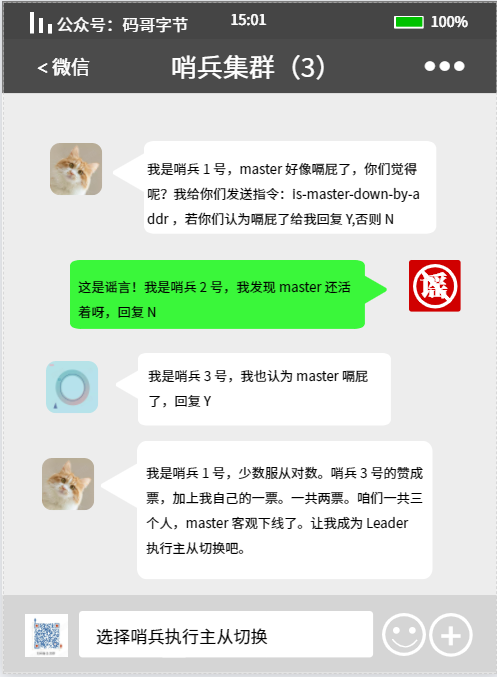

<br>

- **通过 pub/sub 实现客户端事件通知**
- 新 master 选出来了，要怎么公示天下呢？
  - 当然是召开新闻发布会呀，邀请消息相关类型的媒体报道传播，感兴趣的人自然就去关注订阅相关事件，并根据事件做出行动。
- 在 Redis 也是类似，通过 pub/sub 机制发布不同事件，让客户端在这里订阅消息。客户端可以订阅哨兵的消息，哨兵提供的消息订阅频道有很多，不同频道包含了主从库切换过程中的不同关键事件。也就是在不同的“微信群”发布不同的事件，让对该事件感兴趣的人进群即可。
- master 下线事件
  - +sdown：进入“主观下线”状态；
  - -sdown：退出“主观下线”状态；
  - +odown：进入“客观下线”状态；
  - -odown：退出“客观下线”状态；
- slave 重新配置事件
  - +slave-reconf-sent：哨兵发送 replicaof 命令重新配置从库；
  - +slave-reconf-inprog：slave 配置了新 master，但是尚未进行同步；
  - +slave-reconf-done：slave 配置了新 master，并与新 master 完成了数据同步；
- 新主库切换
  - +switch-master：master 地址发生了变化。
- 知道了这些频道之后，就可以让客户端从哨兵这里订阅消息了。客户端读取哨兵的配置文件后，可以获得哨兵的地址和端口，和哨兵建立网络连接。然后，我们可以在客户端执行订阅命令，来获取不同的事件消息。举个栗子：如下指令订阅“所有实例进入客观下线状态的事件”
     `SUBSCRIBE +odown`

<br>

- **注意事项与配置说明**
- 发现了没，Redis 的 pub/sub 发布订阅机制尤其重要，有了 pub/sub 机制，哨兵和哨兵之间、哨兵和从库之间、哨兵和客户端之间就都能建立起连接了，各种事件的发布也是通过这个机制实现。
`down-after-milliseconds`
- Sentinel 配置文件中的 down-after-milliseconds 选项指定了 Sentinel 判断实例进入主观下线所需的时间长度：如果一个实例在 down-after-milliseconds 毫秒内，连续向 Sentinel 返回无效回复，那么 Sentinel 会修改这个实例所对应数据，以此来表示这个实例已经进入主观下线状态。
- 要保证所有哨兵实例的配置是一致的，尤其是主观下线的判断值 down-after-milliseconds。因为这个值在不同的哨兵实例上配置不一致，导致哨兵集群一直没有对有故障的主库形成共识，也就没有及时切换主库，最终的结果就是集群服务不稳定。
`down-after-milliseconds * 10`
- down-after-milliseconds 是我们认定主从库断连的最大连接超时时间。如果在         down-after-milliseconds 毫秒内，主从节点都没有通过网络联系上，我们就可以认为主从节点断连了。如果发生断连的次数超过了 10 次，就说明这个从库的网络状况不好，不适合作为新主库。

---

- **使用主从复制出现的问题:**
 - 主从切换无法自动完成，需要手动操作
 - 写能力和存储能力受限
 - 主从复制 -master 宕机故障处理

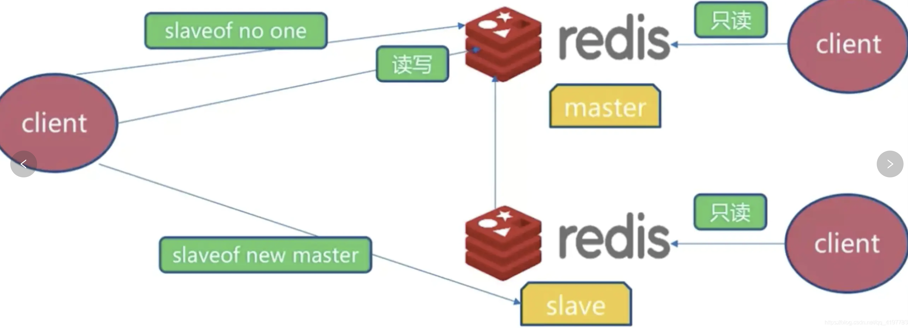
> 主从切换技术的方法是：当主服务器宕机后，需要手动把一台从服务器切换为主服务器，这就需要人工干预，费事费力，还会造成一段时间内服务不可用。这不是一种推荐的方式，更多时候，我们优先考虑哨兵模式。

- **哨兵模式概述**
- 哨兵模式是一种自动选择老大的模式，即在老大宕机之后，哨兵模式会根据哨兵们的内部投票，自动的重新选出一个新的老大。哨兵模式是一种特殊的模式，首先Redis提供了哨兵的命令，哨兵是一个独立的进程，作为进程，它会独立运行。其原理是哨兵通过发送命令，等待Redis服务器响应，如果Redis服务器一直没有响应，说明这个Redis服务器可能已经宕机了，从而监控运行的多个Redis实例。


- 哨兵的主要作用:
  - 通过发送命令，让Redis服务器返回监控其运行状态，包括主服务器和从服务器。
 
  -  当哨兵监测到master宕机，会自动将slave切换成master，然后通过发布订阅模式通知其他的从服务器，修改配置文件，让它们切换主机。
---

- 然而一个哨兵进程对Redis服务器进行监控，可能会出现问题，为此，我们可以使用多个哨兵进行监控。各个哨兵之间还会进行监控，这样就形成了多哨兵模式。

- 用文字描述一下故障切换(failover)的过程。假设主服务器宕机，哨兵1先检测到这个结果，系统并不会马上进行failover过程，仅仅是哨兵1主观的认为主服务器不可用，这个现象成为主观下线。当后面的哨兵也检测到主服务器不可用，并且数量达到一定值时，那么哨兵之间就会进行一次投票，投票的结果由一个哨兵发起，进行failover操作。切换成功后，就会通过发布订阅模式，让各个哨兵把自己监控的从服务器实现切换主机，这个过程称为客观下线。这样对于客户端而言，一切都是透明的。

- 如果有三个哨兵，不仅每个哨兵会监视主机和从机，而且哨兵之间也会互相监视，如下图：
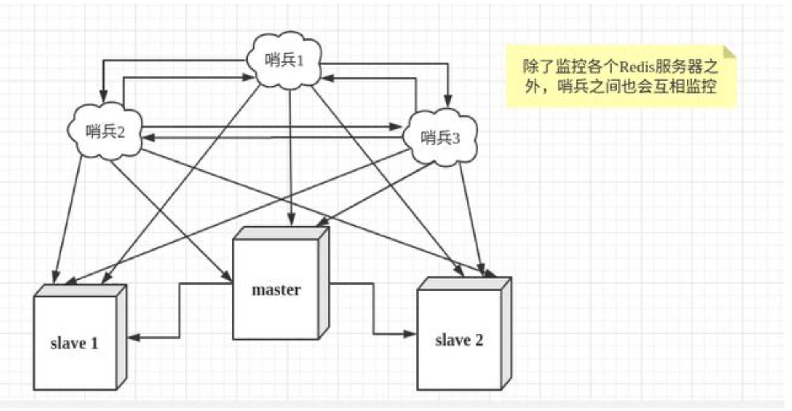

- **哨兵模式架构运行说明**
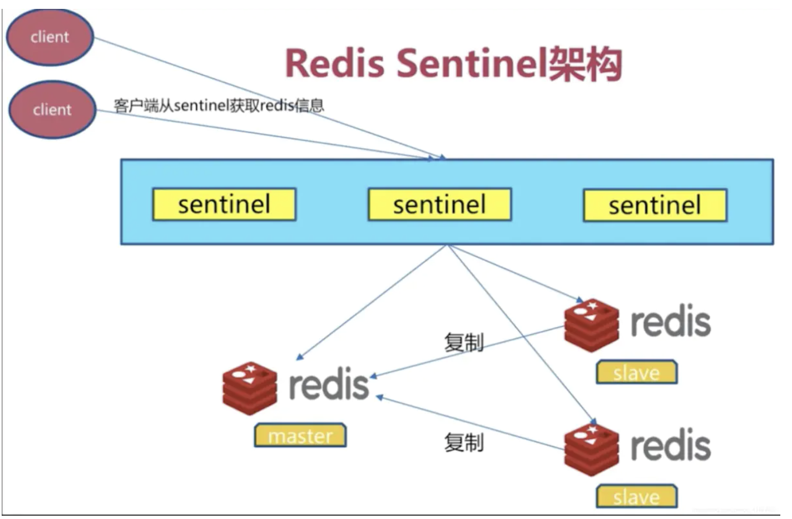
- 多个sentinel 发现并确认master有问题。
- 选举出一个sentinel作为领导
- 选出一个slave作为master
- 通知其余的slave成为新的master的slave
- 通知客户端主从变化
- 等待老的master复活成新的master的slave


- **实验配置**
- 实验拓扑
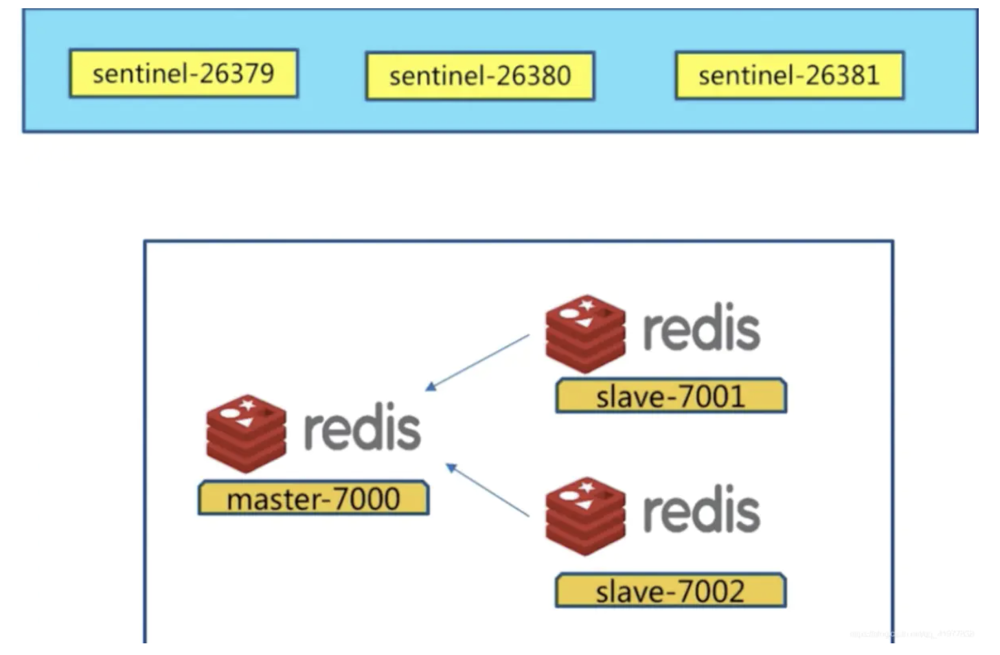

- 先配置一主二从结构
- 主节点配置
```shell
port 6379
daemonize yes
pidfile /var/run/redis-6379.pid
logfile "6379.log"
dir "/opt/soft/redis/data/"
```

- 从节点配置:

	
```shell
#从节点1配置
port 6380
daemonize yes
pidfile /var/run/redis-6380.pid
logfile "6380.log"
dir "/opt/soft/redis/data/"
replicaof 127.0.0.1 6379
```
```shell
#从节点2配置
port 6381
daemonize yes
pidfile /var/run/redis-6381.pid
logfile "6381.log"
dir "/opt/soft/redis/data/"
replicaof 127.0.0.1 6379
```

```shell
#启动所有节点
redis-server redis-6379.conf
redis-server redis-6380.conf
redis-server redis-6381.conf
```

> 到这就配置好了一主二从的结构，下面配置开始配置哨兵的进程

---

- 哨兵模式配置文件说明:

- *哨兵模式的配置文件路径为/etc/redis-sentinel.conf*
- *哨兵模式需要额外安装相应的组件包*

```shell
#哨兵服务端口
port 26379
 
#哨兵工作信息存储目录
dir /tmp
 
#监控主连接字符串哨兵判挂标准（几个哨兵认定他挂了，就判定为主挂了，通常为哨兵数量的一半加一）
sentinel monitor mymaster 127.0.0.1 6379 2
 
#主连接多长时间无响应，就认定它挂了（默认 30s）
sentinel down-after-milliseconds mymaster 30000
 
#主挂了之后，新的主上任同步数据的路线数量，数值越小，对服务器压力越小
sentinel parallel-syncs mymaster 1
 
# 新主同步数据时，多长时间同步完算有效 （默认 180s）
sentinel failover-timeout mymaster 180000

#如果被监控的主机redis服务器有密码的话，还有在sentinel.conf文件中加上认证密码
# sentinel auth-pass 被监控的服务器的名称（可以随意起） password
sentinel auth-pass mymaster 123456

#redius中，默认的账号为default,密码为空，所以上面也可以配置为:
port 26379
sentinel monitor default 127.0.0.1 6379 2
sentinel down-after-milliseconds default 30000
sentinel parallel-syncs default 1
sentinel failover-timeout default 180000
```

- 哨兵1配置:

```shell
port 26379
sentinel monitor mymaster 127.0.0.1 6379 2
sentinel down-after-milliseconds mymaster 30000
sentinel parallel-syncs mymaster 1
sentinel failover-timeout mymaster 180000
```
- 哨兵2配置:
```shell
port 26380
sentinel monitor mymaster 127.0.0.1 6379 2
sentinel down-after-milliseconds mymaster 30000
sentinel parallel-syncs mymaster 1
sentinel failover-timeout mymaster 180000
```
- 哨兵3配置:
```shell
port 263781
sentinel monitor mymaster 127.0.0.1 6379 2
sentinel down-after-milliseconds mymaster 30000
sentinel parallel-syncs mymaster 1
sentinel failover-timeout mymaster 180000
```
- 启动3个哨兵:
```shell
redis-sentinel sentinel-26379.conf
redis-sentinel sentinel-26380.conf
redis-sentinel sentinel-26381.conf
```

> 哨兵模式启动完毕，下面开始对哨兵模式进行测试

---

- **哨兵模式测试**

- 关闭主节点:
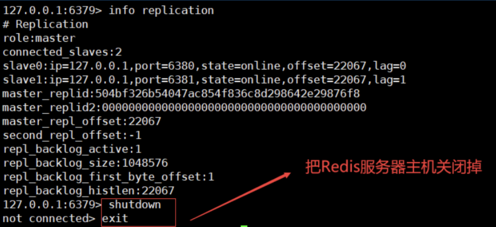

- 查看节点切换情况
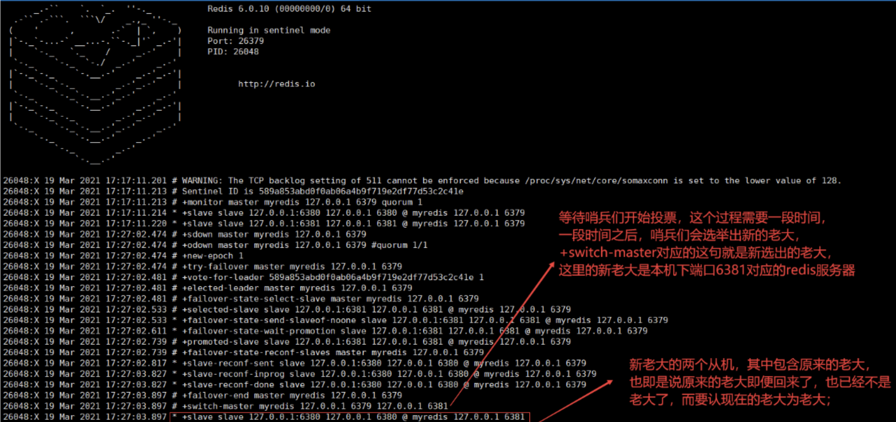

- **哨兵模式实现原理**

- 主观下线和客观下线
  - 主观下线：当前sentintel节点认为某个redis节点不可用
  - 客观下线：所有sentinel节点认为某个redis节点不可用

- 三个定时任务
- 每10秒每个sentinel对master和slave执行info
```shell
- 发现slave节点
- 确认主从关系
```

- 每2秒每个sentinel通过master节点对channel交换信息（发布订阅）
```shell
- 通过_sentinel_:hello频道交互
- 交互对节点的“看法”和自身信息
```

- 每1秒每个sentinel 对其他sentinel和redis执行ping
  - 领导者选举
    - 只需要一个sentinel节点完成故障转移
    - 通过sentinel is - master -down -by-addr 命令都希望成为领导者
```shell
#每个主观下线都Sentitle 节点向其他Sentinel节点发送命令，要求将它设置为领导者
#收到命令对Sentinel节点如果没有同一通过其他Sentinel节点发送的命令，那么就将同一该请求，否则拒绝
#如果该Sentinel节点发现直接的票数已经超过Sentinel集合半数且超过quorum，那么它将成为领导者
#如果此过程由多个Sentinel节点成为领导者，那么将来等待一段时间重新进行选举
```

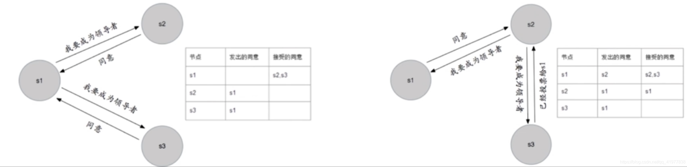


- 故障转移（Sentinel领导者节点完成）
  - 从slave节点中选出一个 “合适点”节点作为master节点
  - 对上面对slave节点执行slaveof no one 命令让其成为master节点。
  - 向剩余的slave节点发送命令，让它们成为新的maater节点的slave节点，复制规避和parallel-syncs参数有关
  - 更新对原来master节点配置为slave，并保持着对其 “关注”，当其恢复后命令他去复制新对master节点

- 选择 “合适的” slave节点
  - 选择slave-priority（slave节点优先级）最高对slave节点，如果存在返回，不存在继续
  - 选择复制偏移量最大的slave节点，复制最完整，存在返回，不存在继续
  - 选择runId最小的slave节点


---

#### 需要说明的问题
> 1.尽可能在不同物理机上和同一个网络部署Redis sentinel的所有节点
> 
> 2.Redis sentinel中的sentinel节点个数应该大于等于3且最好是奇数。（节点数多可以保证高可用）
> 
> 3.Redis sentinel中的数据节点和普通数据节点没有区别。每个sentinel节点在本质上还是一个Redis实例，只不过和Redis数据节点不同的是，其主要作用是监控Redis数据节点
> 
> 4.客户端初始化时连接的是sentinel节点集合，不再是具体的Redis节点，但sentinel只是配置中心不是代理。


